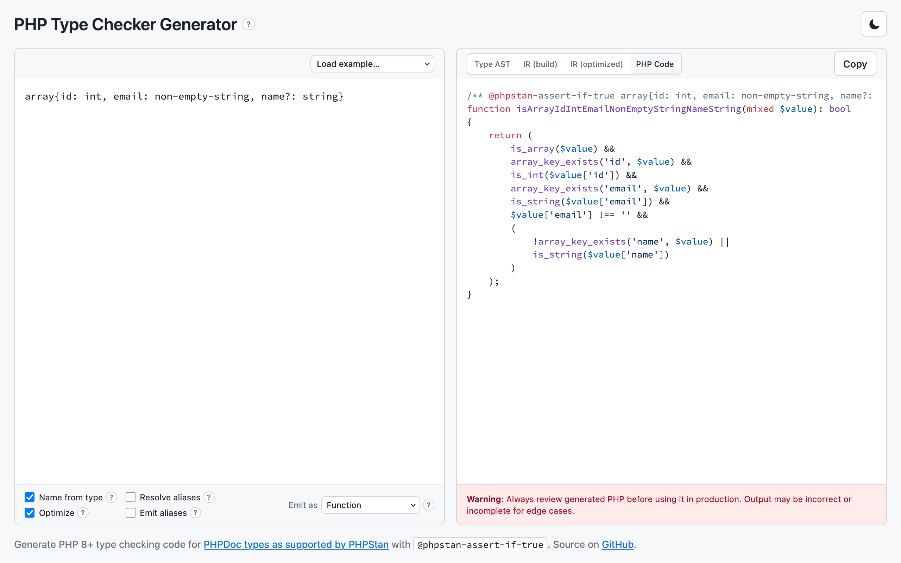

# PHP Type Checker Generator

Parse [PHPDoc types as supported by PHPStan](https://phpstan.org/writing-php-code/phpdoc-types) and generate readable PHP 8+ runtime checkers with `@phpstan-assert-if-true` — code that is meant to pass PHPStan at its strictest settings.

> **Disclaimer:** This project is vibe-coded — built quickly with minimal review. Use it at your own risk; always check any outputted code for correctness yourself.

## Try it

**[Open the live demo](https://check.guys.wtf)** — paste a type or PHPDoc block and copy the generated PHP. Prefer the deployed UI over running a local server.



## Features

- Parse the PHPDoc types PHPStan supports (primitives, unions, shapes, generics, int ranges, aliases, and more)
- Input is just type expressions or a PHPDoc block with `@phpstan-type` aliases — nothing else required
- Emit standalone functions or static methods you can drop into your own code
- Shared helpers for nested types, with readable names like `isPostListResponse` by default
- UI that runs entirely in your browser — no server-side code or analytics

## Examples

### Type expression

Input:

```
array{foo: int, bar?: string}
```

Generated PHP:

```php
/** @phpstan-assert-if-true array{foo: int, bar?: string} $value */
function isArrayFooIntBarString(mixed $value): bool
{
    return (
        is_array($value) &&
        array_key_exists('foo', $value) &&
        is_int($value['foo']) &&
        (
            !array_key_exists('bar', $value) ||
            is_string($value['bar'])
        )
    );
}
```

### Docblock aliases

Input:

```php
/**
 * @phpstan-type PostSummary array{
 *   id: positive-int,
 *   slug: non-empty-string,
 *   title: string
 * }
 * @phpstan-type PaginationMeta array{
 *   page: positive-int,
 *   perPage: positive-int,
 *   total: int
 * }
 * @phpstan-type PostListResponse array{
 *   posts: list<PostSummary>,
 *   meta: PaginationMeta
 * }
 */
```

Generated PHP (excerpt — each alias is a separate check function; cross-refs call the matching function):

```php
/** @phpstan-assert-if-true PostSummary $value */
function isPostSummary(mixed $value): bool
{
    return (is_array($value) && array_key_exists('id', $value) && is_int($value['id']) && $value['id'] > 0 && array_key_exists('slug', $value) && is_string($value['slug']) && $value['slug'] !== '' && array_key_exists('title', $value) && is_string($value['title']));
}

/** @phpstan-assert-if-true PostListResponse $value */
function isPostListResponse(mixed $value): bool
{
    if (
        !is_array($value) ||
        !array_key_exists('posts', $value) ||
        !is_array($value['posts']) ||
        !array_is_list($value['posts'])
    ) {
        return FALSE;
    }
    foreach ($value['posts'] as $var0) {
        if (!isPostSummary($var0)) {
            return FALSE;
        }
    }
    return (array_key_exists('meta', $value) && isPaginationMeta($value['meta']));
}
```

## Develop locally

```bash
corepack enable   # once per machine, if Yarn is not available
yarn install
yarn dev          # http://localhost:5173
yarn test
yarn build
yarn lint
yarn lint:fix
yarn spellcheck
```

Linting is [Oxlint](https://oxc.rs/docs/guide/usage/linter.html) with type-aware TypeScript checks: stock category presets for high-signal correctness (plus a bit of strictness), not a hand-tuned rule list. Exact settings live in [`.oxlintrc.json`](.oxlintrc.json); what each rule means is in the [Oxlint rules reference](https://oxc.rs/docs/guide/usage/linter/rules.html).

Contributor / agent notes (fixtures, warnings, CI): see [AGENTS.md](AGENTS.md).
