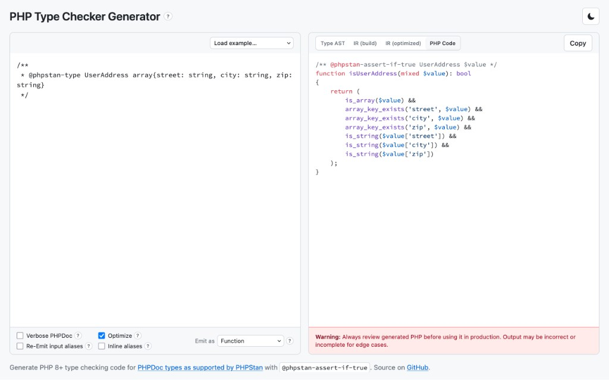
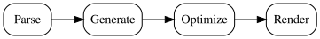
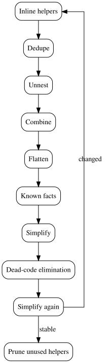

# PHP Type Checker Generator

Parse [PHPDoc types as supported by PHPStan](https://phpstan.org/writing-php-code/phpdoc-types) and generate readable PHP 8+ runtime checkers with `@phpstan-assert-if-true` — code that is meant to pass PHPStan at its strictest settings.

> **Disclaimer:** This project is vibe-coded — built quickly with minimal review. Use it at your own risk; always check any outputted code for correctness yourself.

## Try it

**[Open the live demo](https://check.guys.wtf)** — paste a PHPDoc `@phpstan-type` block (or plain types) and copy the generated PHP. 



## Features

- Parse the PHPDoc types PHPStan supports (primitives, unions, shapes, generics, int ranges, aliases, and more)
- Primary input is PHPDoc with `@phpstan-type` aliases (multiple comments allowed); plain type expressions work as a convenience
- Emit standalone functions or static methods you can drop into your own code
- Shared helpers for nested types, with readable names like `isPostListResponse` by default
- UI that runs entirely in your browser — no server-side code or analytics

## Examples

### Docblock aliases

Input:

```php
/**
 * @phpstan-type PostSummary array{
 *   id: positive-int,
 *   slug: non-empty-string,
 *   title: string
 * }
 * @phpstan-type PaginationMeta array{
 *   page: positive-int,
 *   perPage: positive-int,
 *   total: int
 * }
 * @phpstan-type PostListResponse array{
 *   posts: list<PostSummary>,
 *   meta: PaginationMeta
 * }
 */
```

Generated PHP (excerpt — each alias is a separate check function; cross-refs call the matching function):

```php
/** @phpstan-assert-if-true PostSummary $value */
function isPostSummary(mixed $value): bool
{
    return (
        is_array($value) &&
        array_key_exists('id', $value) &&
        array_key_exists('slug', $value) &&
        array_key_exists('title', $value) &&
        is_int($value['id']) &&
        $value['id'] > 0 &&
        is_string($value['slug']) &&
        $value['slug'] !== '' &&
        is_string($value['title'])
    );
}

/** @phpstan-assert-if-true PostListResponse $value */
function isPostListResponse(mixed $value): bool
{
    if (
        !is_array($value) ||
        !array_key_exists('posts', $value) ||
        !is_array($value['posts']) ||
        !array_is_list($value['posts'])
    ) {
        return FALSE;
    }
    foreach ($value['posts'] as $var0) {
        if (!isPostSummary($var0)) {
            return FALSE;
        }
    }
    return (array_key_exists('meta', $value) && isPaginationMeta($value['meta']));
}
```

### Plain type expression 

It is also possible to paste in a raw type expression. 
For example:

```
array{foo: int, bar?: string}
```

Generated PHP:

```php
/** @phpstan-assert-if-true array{foo: int, bar?: string} $value */
function isArrayFooIntBarString(mixed $value): bool
{
    return (
        is_array($value) &&
        array_key_exists('foo', $value) &&
        is_int($value['foo']) &&
        (
            !array_key_exists('bar', $value) ||
            is_string($value['bar'])
        )
    );
}
```

## Technical Overview

Generation runs in four phases, which can be seen in the diagram below:



- **Parse**:
  Reads `@phpstan-type` aliases (or a plain type expression).
  Tokenizes PHPStan PHPDoc types, rejects cycles and duplicate aliases, and assigns check function names (`User` becomes `isUser`; unnamed types are named from the type text).
  Mentions of other phpstan-types are directly inlined into the type AST, unless configured otherwise.
- **Generate**:
  Walks each type and build an **abstract checker**.
  The abstract checkers are represented as a very simplified php AST acting as an IR.

  The IR represents each checker as a so-called block, an ordered list of statements.
  A statement can be an `if` condition, a `foreach` loop, or a `return`.
  These take expressions and child-blocks as parameters.
  Each expression can be an access to a variable, a comparison, a function call, or boolean combinations thereof.

  The abstract generated checkers are fail-fast functions.
  They typically correspond to a bunch of `if (!cond) return FALSE` plus a trailing `return TRUE`, or `foreach` for collections.
  Simple predicates are usually boolean expressions; shapes and collections add key/property checks and loops; types that cannot be a single expression become extra helpers.
  Which exact code is generated for which type is described in more detail in the `Generate` section below.

- **Optimize**:
  Rewrites the abstract checker functions in place (helpers first, then callers) until nothing changes: inlines leftovers, boolean algebra, drop dead code, delete unused helpers.
  More details below.
- **Render**:
  This final check writes **actual PHP**, rendering the AST into real PHP 8+ functions (or static methods) with `@phpstan-assert-if-true`.

Generate and Optimize work on an abstract checkers (guards, loops, returns) that is not PHP yet; only Render emits actual PHP.
Examples below show that abstract form as PHP so it is readable.

Generated checkers are meant to pass PHPStan at level 10; anything else is considered a bug.
Some PHPStan types cannot be checked at runtime (see Uncheckable below).

### Generate

The output of the Generate phase is very naïve.
A set of fail-fast conditions.

For example, for `int` the abstract checker looks like:

```php
if (!is_int($value)) {
    return FALSE;
}
return TRUE;
```

The actual implementation represents this checker using a more abstract representation, however for purposes of this document we are showing the equivalent PHP syntax.
It is also possible to see the naïve checker code in the interface, by disabling the optimize phase.

Checkers for other types use functions other than `is_int`.
They can be seen in the following sections.

#### Scalars

| Type                      | Check                                                          |
|---------------------------|----------------------------------------------------------------|
| `int` / `integer`         | `is_int($value)`                                               |
| `string`                  | `is_string($value)`                                            |
| `float` / `double`        | `is_float($value)`                                             |
| `bool` / `boolean`        | `is_bool($value)`                                              |
| `array`                   | `is_array($value)`                                             |
| `object`                  | `is_object($value)`                                            |
| `iterable`                | `is_iterable($value)`                                          |
| `callable`                | `is_callable($value)`                                          |
| `resource`                | `is_resource($value)`                                          |
| `scalar`                  | `is_scalar($value)`                                            |
| `number` / `numeric`      | `is_int($value) \|\| is_float($value)`                         |
| `array-key`               | `is_string($value) \|\| is_int($value)`                        |
| `null` / `true` / `false` | `$value === NULL` / `TRUE` / `FALSE`                           |
| `mixed`                   | `TRUE`                                                         |
| `never` / `noreturn`      | `FALSE`                                                        |
| `empty`                   | `$value === FALSE \|\| $value === 0 \|\| …` (PHP empty values) |
| `non-empty-mixed`         | `$value !== FALSE && $value !== 0 && …` (same empties)         |

#### Int refinements and ranges

| Type               | Check                                            |
|--------------------|--------------------------------------------------|
| `positive-int`     | `is_int($value) && $value > 0`                   |
| `negative-int`     | `is_int($value) && $value < 0`                   |
| `non-positive-int` | `is_int($value) && $value <= 0`                  |
| `non-negative-int` | `is_int($value) && $value >= 0`                  |
| `non-zero-int`     | `is_int($value) && $value !== 0`                 |
| `int<0, 100>`      | `is_int($value) && $value >= 0 && $value <= 100` |
| `int<50, max>`     | `is_int($value) && $value >= 50`                 |
| `int<min, 100>`    | `is_int($value) && $value <= 100`                |
| `int<min, max>`    | `is_int($value)`                                 |

#### String refinements

| Type                                                 | Check                                                                        |
|------------------------------------------------------|------------------------------------------------------------------------------|
| `non-empty-string`                                   | `is_string($value) && $value !== ''`                                         |
| `non-falsy-string` / `truthy-string`                 | `is_string($value) && $value !== '' && $value !== '0'`                       |
| `lowercase-string`                                   | `is_string($value) && strtolower($value) === $value`                         |
| `uppercase-string`                                   | `is_string($value) && strtoupper($value) === $value`                         |
| `numeric-string`                                     | `is_string($value) && is_numeric($value)`                                    |
| `callable-string`                                    | `is_string($value) && is_callable($value)`                                   |
| `decimal-int-string`                                 | `is_string($value) && preg_match('/^-?(?:0\|[1-9]\\d*)$/', $value) === 1`    |
| `non-decimal-int-string`                             | same pattern with `!== 1`                                                    |
| `class-string` / `interface-string` / `trait-string` | `is_string($value) && class_exists($value)` (runtime cannot tell them apart) |
| `enum-string`                                        | `is_string($value) && is_a($value, \UnitEnum::class, TRUE)`                  |

#### class-string generics

| Type                    | Check                                                                         |
|-------------------------|-------------------------------------------------------------------------------|
| `class-string<MyClass>` | `is_string($value) && is_a($value, MyClass::class, TRUE)`                     |
| `class-string<A\|B>`    | `is_string($value) && (is_a(…, A::class, TRUE) \|\| is_a(…, B::class, TRUE))` |
| `class-string<A&B>`     | `is_string($value) && is_a(…, A::class, TRUE) && is_a(…, B::class, TRUE)`     |
| `enum-string<MyEnum>`   | `enum-string` check plus `is_a($value, MyEnum::class, TRUE)`                  |

#### Named types and literals

| Type                     | Check                                                  |
|--------------------------|--------------------------------------------------------|
| `Foo` / `\Foo\Bar`       | `$value instanceof Foo`                                |
| `callable-array`         | `is_array($value) && is_callable($value)`              |
| `callable-object`        | `is_object($value) && is_callable($value)`             |
| `'foo'` / `42` / `69.42` | `$value === 'foo'` / `42` / `69.42` (quotes preserved) |

#### Unions, intersections, and aliases

| Type                                | Check                                                                                         |
|-------------------------------------|-----------------------------------------------------------------------------------------------|
| `int\|string`                       | `is_int($value) \|\| is_string($value)`                                                       |
| Loop-heavy union arm                | Helper call, or early `if (simpleArm) return TRUE` then the complex arm                       |
| `Foo&Bar`                           | Consecutive checks (`&&` after Optimize); redundant `is_array` / `is_object` dropped by Optimize |
| `@phpstan-type` alias `PostSummary` | `isPostSummary($value)` (not inlined)                                                         |
| Nested non-boolean type             | Extra shared `is…` helper                                                                     |

#### Collections

Collection checks are typically represented by loops.
For example for `list<int>`:

```php
if (!is_array($value) || !array_is_list($value)) {
    return FALSE;
}
foreach ($value as $var0) {
    if (!is_int($var0)) {
        return FALSE;
    }
}
return TRUE;
```

| Type                         | Check                                                              |
|------------------------------|--------------------------------------------------------------------|
| `array<T>` / `T[]`           | `is_array($value)`, then `foreach` over values                     |
| `array<K, V>`                | `foreach ($value as $k => $v)` checking key and value              |
| `list<T>`                    | `is_array($value) && array_is_list($value)`, then `foreach` values |
| `non-empty-*`                | Same as above, plus `$value !== []`                                |
| `array<mixed>` / bare `list` | Container test only                                                |
| `array<never>` / `array{}`   | `$value === []`                                                    |
| Nested arrays                | Nested `foreach`                                                   |
| Parameterized `iterable<…>`  | Not generated (foreach would not be side-effect-free)              |

#### Shapes

Shapes represent non-homogenous containers.
These are typically represented by existence check, followed by a type check on each property.
For example for `array{name: string, age: int}`:

```php
if (!is_array($value)) {
    return FALSE;
}
if (!array_key_exists('name', $value)) {
    return FALSE;
}
if (!is_string($value['name'])) {
    return FALSE;
}
if (!array_key_exists('age', $value)) {
    return FALSE;
}
if (!is_int($value['age'])) {
    return FALSE;
}
return TRUE;
```

This example checks for required keys.
For optional keys, the value type check takes place inside the if, as opposed to after it.
For example for `array{age?: int}`:

```php
if (!is_array($value)) {
    return FALSE;
}
if (!array_key_exists('age', $value)) {
    if (!is_int($value['age'])) {
        return FALSE;
    }
}
return TRUE;
```


In more general terms, the following shapes are supported:

| Type                            | Check                                         |
|---------------------------------|-----------------------------------------------|
| `array{foo: int, bar?: string}` | `is_array`; `array_key_exists`                |
| `array{int, string}`            | Expanded to indexes `0`, `1`, …               |
| `list{int, string}`             | Same as array tuple, plus `array_is_list`     |
| `object{foo: int}`              | `is_object`; `property_exists`; `$value->foo` |

#### Uncheckable

Some types cannot be checked at runtime.
These are:

- `void`:
    This represents "no value", so there is no `$value` to look at.
- `literal-string`:
    There is no way for the PHP runtime to know if a string is literal, as the [`is_literal` RFC](https://wiki.php.net/rfc/is_literal) was rejected.
- `open-resource`, `closed-resource`:
    The php runtime cannot distinguish between these.
- `static` / `self` / `parent` / `$this`:
    These are scope-dependent, and thus cannot be generically checked.
- `callable(…): …`:
    Parameter and return types cannot be verified without either calling the callable, or using reflection.
    The former introduces possible side-effects to a type checking function - which should not be the case.
    The latter could not pick up `@phpstan-type` comments and thus would not work either.
- `Foo<T>`:
    User-defined generics only exist as `@template` tags inside docblocks.
    These cannot be inspected, not even using Reflection.
- `iterable<…>`:
    When parametrized, element checks would require actually iterating.
    This would cause side-effects - which should not be the case.

### Optimize

The generated output is naïve and often generates very verbose code.
The goal of the optimize is to produce nicer code and rewrites the abstract checker in a loop until nothing changes.



| Pass                  | Goal                                                                                         | Before                                                                     | After                                                                             |
|-----------------------|----------------------------------------------------------------------------------------------|----------------------------------------------------------------------------|-----------------------------------------------------------------------------------|
| Inline helpers        | Substitute non-entry helpers at the call site (entry `@phpstan-type` checkers stay as calls) | `return isInt($elem);`                                                     | `return is_int($elem);`                                                           |
| Dedupe                | Drop identical repeated `if` / `foreach`                                                     | Two copies of `if (!is_array($value)) return FALSE;`                       | One copy                                                                          |
| Unnest                | Collapse nested single-body `if`s into one condition                                         | `if (a) { if (b) { … } }`                                                  | `if (a && b) { … }`                                                               |
| Combine               | Merge consecutive `if`s that share the same body                                             | Separate fail-fast `if`s for `!is_array` and `!array_is_list`              | One `if` with `\|\|`                                                              |
| Flatten               | Turn a trailing `if`/`return` pair into one `return` expression                              | `if (is_int($value)) return TRUE; return FALSE;`                           | `return is_int($value);` (via `($cond && $b) \|\| (!$cond && $c)`, then Simplify) |
| Known facts           | Replace tests already proven true or false by earlier control flow                           | After `if (is_array($value)) return TRUE;`, later `if (!is_array($value))` | Later guard is dead                                                               |
| Simplify              | Fold boolean algebra, contradictions, factoring, and related rewrites (see below)            |                                                                            |                                                                                   |
| Dead-code elimination | Remove unreachable or empty statements                                                       | `if (FALSE) { … }`, code after `return`, empty `foreach`                   | Removed / spliced away                                                            |
| Prune helpers         | Delete helpers that nothing calls anymore                                                    | Helper with no remaining callers                                           | Helper deleted                                                                    |

#### Simplify expressions

The simplify phase simplifies boolean expressions.

| Before                                             | After                                                                              |
|----------------------------------------------------|------------------------------------------------------------------------------------|
| `TRUE` / `FALSE` in `&&` / `\|\|`; `!!$x`          | Folded / `$x`; De Morgan for `!(a && b)` / `!(a \|\| b)`                           |
| `$x && !$x`                                        | `FALSE`                                                                            |
| `$x \|\| !$x`                                      | `TRUE`                                                                             |
| Duplicate operands                                 | One copy                                                                           |
| `(is_int && is_string) \|\| (is_int && is_bool)`   | `is_int && (is_string \|\| is_bool)`                                               |
| `is_a($x, Foo::class, TRUE) \|\| class_exists($x)` | `class_exists($x)` (OR keeps the weaker fact)                                      |
| `is_a(…) && class_exists(…)`                       | `is_a(…)` (AND keeps the stronger fact; same idea for `instanceof` vs `is_object`) |
| `!($x !== [])`                                     | `$x === []`                                                                        |
| `!($x > 0)`                                        | `$x <= 0`                                                                          |

In practice, a lot of these combine.
For example, `list<mixed>|list<string>` becomes `is_array($value) && array_is_list($value)` because the second arm is redundant.

## Develop locally

```bash
corepack enable   # once per machine, if Yarn is not available
yarn install
yarn dev          # http://localhost:5173
yarn test
yarn build
yarn lint         # Oxlint
yarn lint:fix
yarn spellcheck
```

Contributor / agent notes (fixtures, warnings, CI): see [AGENTS.md](AGENTS.md).
