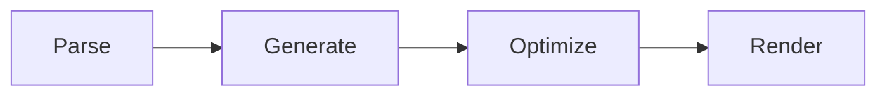
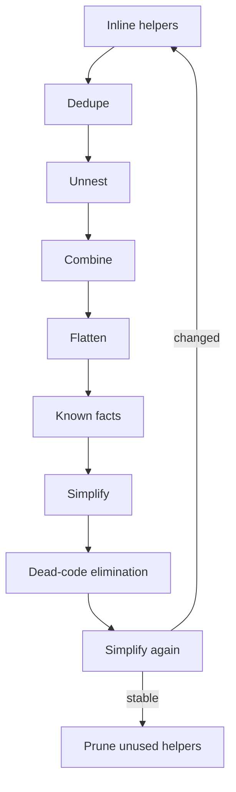

# PHP Type Checker Generator

Parse [PHPDoc types as supported by PHPStan](https://phpstan.org/writing-php-code/phpdoc-types) and generate readable PHP 8+ runtime checkers with `@phpstan-assert-if-true` — code that is meant to pass PHPStan at its strictest settings.

> **Disclaimer:** This project is vibe-coded — built quickly with minimal review. Use it at your own risk; always check any outputted code for correctness yourself.

## Try it

**[Open the live demo](https://check.guys.wtf)** — paste a PHPDoc `@phpstan-type` block (or plain types) and copy the generated PHP. Prefer the deployed UI over running a local server.


## Features

- Parse the PHPDoc types PHPStan supports (primitives, unions, shapes, generics, int ranges, aliases, and more)
- Primary input is PHPDoc with `@phpstan-type` aliases (multiple comments allowed); plain type expressions work as a convenience
- Emit standalone functions or static methods you can drop into your own code
- Shared helpers for nested types, with readable names like `isPostListResponse` by default
- UI that runs entirely in your browser — no server-side code or analytics

## Examples

### Docblock aliases

Input:

```php
/**
 * @phpstan-type PostSummary array{
 *   id: positive-int,
 *   slug: non-empty-string,
 *   title: string
 * }
 * @phpstan-type PaginationMeta array{
 *   page: positive-int,
 *   perPage: positive-int,
 *   total: int
 * }
 * @phpstan-type PostListResponse array{
 *   posts: list<PostSummary>,
 *   meta: PaginationMeta
 * }
 */
```

Generated PHP (excerpt — each alias is a separate check function; cross-refs call the matching function):

```php
/** @phpstan-assert-if-true PostSummary $value */
function isPostSummary(mixed $value): bool
{
    return (is_array($value) && array_key_exists('id', $value) && is_int($value['id']) && $value['id'] > 0 && array_key_exists('slug', $value) && is_string($value['slug']) && $value['slug'] !== '' && array_key_exists('title', $value) && is_string($value['title']));
}

/** @phpstan-assert-if-true PostListResponse $value */
function isPostListResponse(mixed $value): bool
{
    if (
        !is_array($value) ||
        !array_key_exists('posts', $value) ||
        !is_array($value['posts']) ||
        !array_is_list($value['posts'])
    ) {
        return FALSE;
    }
    foreach ($value['posts'] as $var0) {
        if (!isPostSummary($var0)) {
            return FALSE;
        }
    }
    return (array_key_exists('meta', $value) && isPaginationMeta($value['meta']));
}
```

### Plain type expression (convenience)

Input:

```
array{foo: int, bar?: string}
```

Generated PHP:

```php
/** @phpstan-assert-if-true array{foo: int, bar?: string} $value */
function isArrayFooIntBarString(mixed $value): bool
{
    return (
        is_array($value) &&
        array_key_exists('foo', $value) &&
        is_int($value['foo']) &&
        (
            !array_key_exists('bar', $value) ||
            is_string($value['bar'])
        )
    );
}
```

## Technical Overview

Generation runs in four phases.


```mermaid
flowchart LR
  Parse --> Generate --> Optimize --> Render
```

- **Parse**:
  Read `@phpstan-type` aliases (or a plain type expression).
  Tokenize PHPStan PHPDoc types, reject cycles and duplicate aliases, and assign checker names (`User` becomes `isUser`; unnamed types are named from the type text).
  Mentions of an alias become calls to that alias’s checker unless aliases are inlined into each definition.
- **Generate**:
  Walk each type and build an **abstract checker** IR: fail-fast `if (!cond) return FALSE` plus a trailing `return TRUE`, plus `foreach` for collections.
  Simple predicates are boolean expressions; shapes and collections add key/property checks and loops; types that cannot be a single expression become extra helper checkers (shared when the nested type is reused).
- **Optimize**:
  Rewrite that abstract checker in place (helpers first, then callers) until nothing changes: inline leftovers, boolean algebra, drop dead code, delete unused helpers.
  User-facing alias checkers are never inlined or deleted.
- **Render** — The first step that writes **actual PHP**: pretty-printed PHP 8+ functions (or static methods) with `@phpstan-assert-if-true`, from the optimized abstract checker.

Generate and Optimize work on an abstract checker (guards, loops, returns) that is not PHP yet; only Render emits actual PHP.
Examples below show that abstract form as PHP so it is readable.

Generated checkers are meant to pass PHPStan at level 10.
Some PHPStan types cannot be checked at runtime (see Uncheckable below).

### Generate

Naïve generation is fail-fast.
For example, for `int` the abstract checker looks like:

```php
if (!is_int($value)) {
    return FALSE;
}
return TRUE;
```

Other checker make use of other constructors.

#### Scalars

| Type                      | Check                                                          |
| ------------------------- | -------------------------------------------------------------- |
| `int` / `integer`         | `is_int($value)`                                               |
| `string`                  | `is_string($value)`                                            |
| `float` / `double`        | `is_float($value)`                                             |
| `bool` / `boolean`        | `is_bool($value)`                                              |
| `array`                   | `is_array($value)`                                             |
| `object`                  | `is_object($value)`                                            |
| `iterable`                | `is_iterable($value)`                                          |
| `callable`                | `is_callable($value)`                                          |
| `resource`                | `is_resource($value)`                                          |
| `scalar`                  | `is_scalar($value)`                                            |
| `number` / `numeric`      | `is_int($value) \|\| is_float($value)`                         |
| `array-key`               | `is_string($value) \|\| is_int($value)`                        |
| `null` / `true` / `false` | `$value === NULL` / `TRUE` / `FALSE`                           |
| `mixed`                   | `TRUE`                                                         |
| `never` / `noreturn`      | `FALSE`                                                        |
| `empty`                   | `$value === FALSE \|\| $value === 0 \|\| …` (PHP empty values) |
| `non-empty-mixed`         | `$value !== FALSE && $value !== 0 && …` (same empties)         |

#### Int refinements and ranges

| Type               | Check                                            |
| ------------------ | ------------------------------------------------ |
| `positive-int`     | `is_int($value) && $value > 0`                   |
| `negative-int`     | `is_int($value) && $value < 0`                   |
| `non-positive-int` | `is_int($value) && $value <= 0`                  |
| `non-negative-int` | `is_int($value) && $value >= 0`                  |
| `non-zero-int`     | `is_int($value) && $value !== 0`                 |
| `int<0, 100>`      | `is_int($value) && $value >= 0 && $value <= 100` |
| `int<50, max>`     | `is_int($value) && $value >= 50`                 |
| `int<min, 100>`    | `is_int($value) && $value <= 100`                |
| `int<min, max>`    | `is_int($value)`                                 |

#### String refinements

| Type                                                 | Check                                                                        |
| ---------------------------------------------------- | ---------------------------------------------------------------------------- |
| `non-empty-string`                                   | `is_string($value) && $value !== ''`                                         |
| `non-falsy-string` / `truthy-string`                 | `is_string($value) && $value !== '' && $value !== '0'`                       |
| `lowercase-string`                                   | `is_string($value) && strtolower($value) === $value`                         |
| `uppercase-string`                                   | `is_string($value) && strtoupper($value) === $value`                         |
| `numeric-string`                                     | `is_string($value) && is_numeric($value)`                                    |
| `callable-string`                                    | `is_string($value) && is_callable($value)`                                   |
| `decimal-int-string`                                 | `is_string($value) && preg_match('/^-?(?:0\|[1-9]\\d*)$/', $value) === 1`    |
| `non-decimal-int-string`                             | same pattern with `!== 1`                                                    |
| `class-string` / `interface-string` / `trait-string` | `is_string($value) && class_exists($value)` (runtime cannot tell them apart) |
| `enum-string`                                        | `is_string($value) && is_a($value, \UnitEnum::class, TRUE)`                  |

#### class-string generics

| Type                    | Check                                                                         |
| ----------------------- | ----------------------------------------------------------------------------- |
| `class-string<MyClass>` | `is_string($value) && is_a($value, MyClass::class, TRUE)`                     |
| `class-string<A\|B>`    | `is_string($value) && (is_a(…, A::class, TRUE) \|\| is_a(…, B::class, TRUE))` |
| `class-string<A&B>`     | `is_string($value) && is_a(…, A::class, TRUE) && is_a(…, B::class, TRUE)`     |
| `enum-string<MyEnum>`   | `enum-string` check plus `is_a($value, MyEnum::class, TRUE)`                  |

#### Named types and literals

| Type                     | Check                                                  |
| ------------------------ | ------------------------------------------------------ |
| `Foo` / `\Foo\Bar`       | `$value instanceof Foo`                                |
| `callable-array`         | `is_array($value) && is_callable($value)`              |
| `callable-object`        | `is_object($value) && is_callable($value)`             |
| `'foo'` / `42` / `69.42` | `$value === 'foo'` / `42` / `69.42` (quotes preserved) |

#### Unions, intersections, and aliases

| Type                                | Check                                                                                         |
| ----------------------------------- | --------------------------------------------------------------------------------------------- |
| `int\|string`                       | `is_int($value) \|\| is_string($value)`                                                       |
| Loop-heavy union arm                | Helper call, or early `if (simpleArm) return TRUE` then the complex arm                       |
| `Foo&Bar`                           | Consecutive checks (`&&` after Optimize); skip redundant `is_array` / `is_object` once proven |
| `@phpstan-type` alias `PostSummary` | `isPostSummary($value)` (not inlined)                                                         |
| Nested non-boolean type             | Extra shared `is…` helper                                                                     |

#### Collections

| Type                         | Check                                                              |
| ---------------------------- | ------------------------------------------------------------------ |
| `array<T>` / `T[]`           | `is_array($value)`, then `foreach` over values                     |
| `array<K, V>`                | `foreach ($value as $k => $v)` checking key and value              |
| `list<T>`                    | `is_array($value) && array_is_list($value)`, then `foreach` values |
| `non-empty-*`                | Same as above, plus `$value !== []`                                |
| `array<mixed>` / bare `list` | Container test only                                                |
| `array<never>` / `array{}`   | `$value === []`                                                    |
| Nested arrays                | Nested `foreach`                                                   |
| Parameterized `iterable<…>`  | Not generated (foreach would not be side-effect-free)              |

Example for `list<int>`:

```php
if (!is_array($value) || !array_is_list($value)) {
    return FALSE;
}
foreach ($value as $var0) {
    if (!is_int($var0)) {
        return FALSE;
    }
}
return TRUE;
```

#### Shapes

| Type                            | Check                                                                                |
| ------------------------------- | ------------------------------------------------------------------------------------ |
| `array{foo: int, bar?: string}` | `is_array`; `array_key_exists` for required keys; optional keys wrap the field check |
| `array{int, string}`            | Indexes `0`, `1`, …                                                                  |
| `list{int, string}`             | Same as array tuple, plus `array_is_list`                                            |
| `object{foo: int}`              | `is_object`; `property_exists`; `$value->foo`                                        |

#### Uncheckable

| Type                                   | Why not                                                   |
| -------------------------------------- | --------------------------------------------------------- |
| `void`                                 | No runtime value to check                                 |
| `static` / `self` / `parent` / `$this` | Scope-dependent; not a runtime type test                  |
| `literal-string`                       | PHP cannot verify PHPStan literal-string semantics        |
| `callable(…): …`                       | Parameter/return types cannot be verified without calling |
| User generics (`Foo<T>`)               | Not a supported generic for codegen                       |
| `open-resource` / `closed-resource`    | PHP cannot distinguish open vs closed resources           |
| `trait-string<T>`                      | PHPStan does not support the generic variant              |
| Parameterized `iterable<…>`            | Element checks would require side-effecting iteration     |

### Optimize

The generated output is naïve and often generates very verbose code.
The goal of the optimize is to produce nicer code and rewrites the abstract checker in a loop until nothing changes.


```mermaid
flowchart TD
  inline[Inline helpers]
  dedupe[Dedupe]
  unnest[Unnest]
  combine[Combine]
  flatten[Flatten]
  facts[Known facts]
  simplify[Simplify]
  dce[Dead-code elimination]
  simplify2[Simplify again]
  prune[Prune unused helpers]
  inline --> dedupe --> unnest --> combine --> flatten --> facts --> simplify --> dce --> simplify2
  simplify2 -->|changed| inline
  simplify2 -->|stable| prune
```

| Pass                  | Goal                                                                                         | Before                                                                     | After                                                                             |
| --------------------- | -------------------------------------------------------------------------------------------- | -------------------------------------------------------------------------- | --------------------------------------------------------------------------------- |
| Inline helpers        | Substitute non-entry helpers at the call site (entry `@phpstan-type` checkers stay as calls) | `return isInt($elem);`                                                     | `return is_int($elem);`                                                           |
| Dedupe                | Drop identical repeated `if` / `foreach`                                                     | Two copies of `if (!is_array($value)) return FALSE;`                       | One copy                                                                          |
| Unnest                | Collapse nested single-body `if`s into one condition                                         | `if (a) { if (b) { … } }`                                                  | `if (a && b) { … }`                                                               |
| Combine               | Merge consecutive `if`s that share the same body                                             | Separate fail-fast `if`s for `!is_array` and `!array_is_list`              | One `if` with `\|\|`                                                              |
| Flatten               | Turn a trailing `if`/`return` pair into one `return` expression                              | `if (is_int($value)) return TRUE; return FALSE;`                           | `return is_int($value);` (via `($cond && $b) \|\| (!$cond && $c)`, then Simplify) |
| Known facts           | Replace tests already proven true or false by earlier control flow                           | After `if (is_array($value)) return TRUE;`, later `if (!is_array($value))` | Later guard is dead                                                               |
| Dead-code elimination | Remove unreachable or empty statements                                                       | `if (FALSE) { … }`, code after `return`, empty `foreach`                   | Removed / spliced away                                                            |
| Prune helpers         | Delete helpers that nothing calls anymore                                                    | Helper with no remaining callers                                           | Helper deleted                                                                    |
| Simplify              | Fold boolean algebra, contradictions, factoring, and related rewrites (see below)            |                                                                            |                                                                                   |

#### Simplify expressions

| Before                                             | After                                                                              |
| -------------------------------------------------- | ---------------------------------------------------------------------------------- |
| `TRUE` / `FALSE` in `&&` / `\|\|`; `!!$x`          | Folded / `$x`; De Morgan for `!(a && b)` / `!(a \|\| b)`                           |
| `$x && !$x`                                        | `FALSE`                                                                            |
| `$x \|\| !$x`                                      | `TRUE`                                                                             |
| Duplicate operands                                 | One copy                                                                           |
| `(is_int && is_string) \|\| (is_int && is_bool)`   | `is_int && (is_string \|\| is_bool)`                                               |
| `is_a($x, Foo::class, TRUE) \|\| class_exists($x)` | `class_exists($x)` (OR keeps the weaker fact)                                      |
| `is_a(…) && class_exists(…)`                       | `is_a(…)` (AND keeps the stronger fact; same idea for `instanceof` vs `is_object`) |
| `!($x !== [])`                                     | `$x === []`                                                                        |
| `!($x > 0)`                                        | `$x <= 0`                                                                          |

In practice these combine.
For example, `list<mixed>|list<string>` becomes `is_array($value) && array_is_list($value)` because the second arm is redundant.

## Develop locally

```bash
corepack enable   # once per machine, if Yarn is not available
yarn install
yarn dev          # http://localhost:5173
yarn test
yarn build
yarn lint         # Oxlint
yarn lint:fix
yarn spellcheck
```

Contributor / agent notes (fixtures, warnings, CI): see [AGENTS.md](AGENTS.md).
